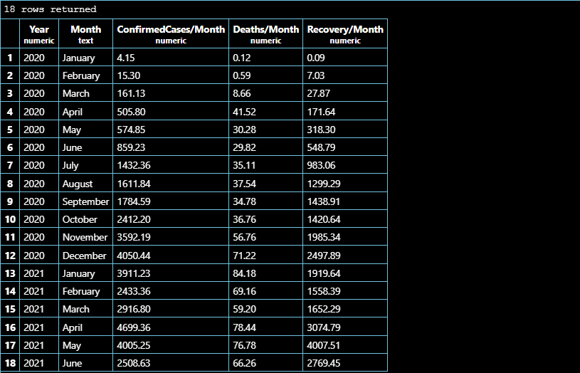
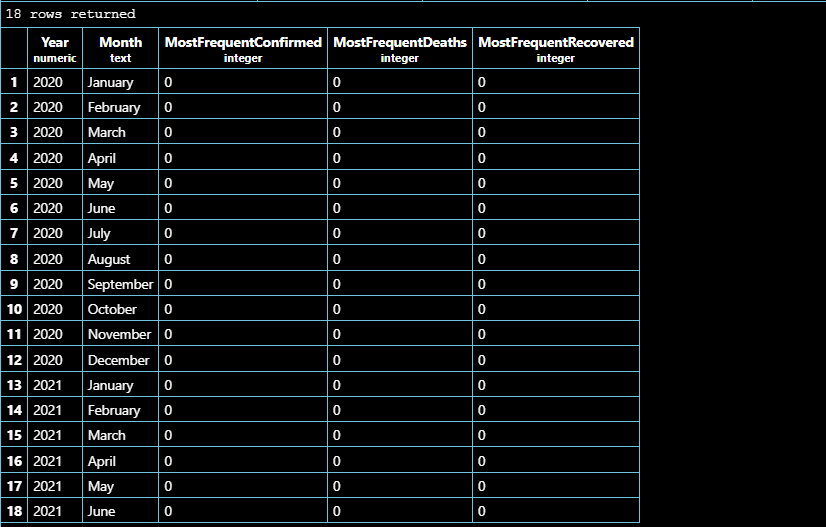
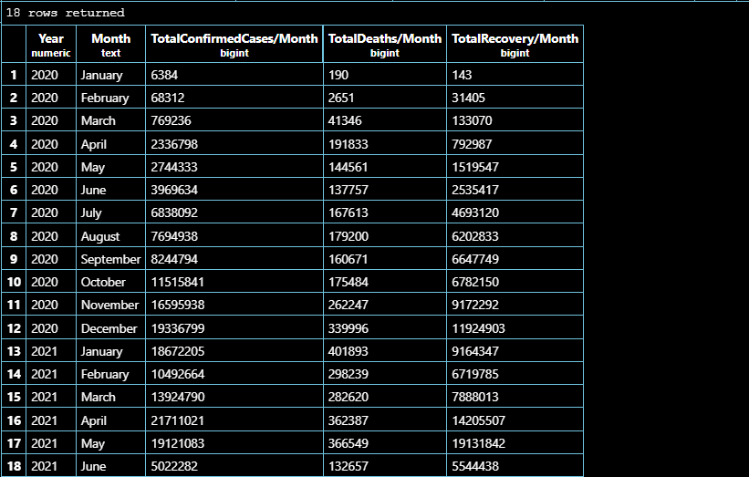
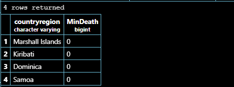

<!-- _class: invert -->


# **MENTORNESS INTERNSHIP PROJECT**

## **CORONA VIRUS ANALYSIS**
<br>
<br>

#### ADURAGBEMI OYINLOLA

---

### **OVERVIEW:**
<!-- _class: invert -->


The **CORONA VIRUS** pandemic has had a significant impact on public health and has created an urgent need for data-driven insights to understand the spread of the virus. 

For this task, I will be analyzing the **CORONA VIRUS** dataset to find answers by writing **SQL (PostgreSQL)** queries, derive meaningful insights and present my findings.

---
<!-- _class: invert -->


### **DATASET:**
The dataset contains 8 fields:

- Province: Geographic subdivision within a country/region.
- Country/Region: Geographic entity where data is recorded.
- Latitude: North-south position on Earth's surface.
- Longitude: Eat-west position on Earth's surface.
- Date: Recorded date of CORONA VIRUS cases.
- Confirmed: Number of diagnosed CORONA VIRUS cases.
- Deaths: Number of CORONA VIRUS related deaths.
- Recovered: Number of recovered CORONA VIRUS cases.

---
<!-- _class: invert -->


Q1. Write a code to check NULL values

```
SELECT *
FROM corona_data
WHERE province IS NULL
    OR countryregion IS NULL OR latitude IS NULL
    OR longitude IS NULL OR date IS NULL
    OR confirmed IS NULL OR deaths IS NULL
    OR recovered IS NULL;
```

<br>


---
<!-- _class: invert -->


Q2. If NULL values are present, update them with zeros for all columns.

```
UPDATE corona_data
SET province = 0, countryregion = 0, latitude = 0, 
    longitude = 0, confirmed = 0, deaths = 0,
    recovered = 0
WHERE province IS NULL OR countryregion IS NULL OR
    latitude IS NULL OR longitude IS NULL OR 
    confirmed IS NULL OR deaths IS NULL OR
    recovered IS NULL;
```


---
<!-- _class: invert -->


Q3. check total number of rows

```
SELECT COUNT(*)
FROM coronavirus;
```
<br>
<br>


---
<!-- _class: invert -->


Q4. Check what is start_date and end_date

```
SELECT MIN(date) AS start_date, MAX(date) AS end_date
FROM corona_data;
```

<br>
<br>


---
<!-- _class: invert -->


Q5. Number of month present in dataset

```
SELECT EXTRACT(YEAR FROM date) AS "Year", 
    COUNT(DISTINCT EXTRACT(MONTH FROM date)) AS "monthNumber"
FROM corona_data
GROUP BY EXTRACT(YEAR FROM date);
```

<br>


---
<!-- _class: invert -->


Q6. Find monthly average for confirmed, deaths, recovered

```
SELECT 
    EXTRACT(YEAR FROM date) AS "Year", TO_CHAR(date, 'Month') AS "Month", 
    ROUND(AVG(confirmed), 2) AS "ConfirmedCases/Month",
    ROUND(AVG(deaths), 2) AS "Deaths/Month", 
    ROUND(AVG(recovered), 2) AS "Recovery/Month"
FROM corona_data
GROUP BY EXTRACT(YEAR FROM date), TO_CHAR(date, 'Month'), 
    EXTRACT(MONTH FROM date)
ORDER BY EXTRACT(YEAR FROM date), EXTRACT(MONTH FROM date);
```

---
<!-- _class: invert -->




---
<!-- _class: invert -->


Q7. Find most frequent value for confirmed, deaths, recovered each month

```
SELECT
    EXTRACT(YEAR FROM date) AS "Year",
    TO_CHAR(date, 'Month') AS "Month",
    MODE() WITHIN GROUP (ORDER BY confirmed) AS "MostFrequentConfirmed",
    MODE() WITHIN GROUP (ORDER BY deaths) AS "MostFrequentDeaths",
    MODE() WITHIN GROUP (ORDER BY recovered) AS "MostFrequentRecovered"
FROM corona_data
GROUP BY EXTRACT(YEAR FROM date), TO_CHAR(date, 'Month'), 
    EXTRACT(MONTH FROM date)
ORDER BY EXTRACT(YEAR FROM date), EXTRACT(MONTH FROM date);
```
---
<!-- _class: invert -->




---
<!-- _class: invert -->


Q8. Find minimum values for confirmed, deaths, recovered per year

```
SELECT EXTRACT(YEAR FROM date) AS "Year", MIN(confirmed) AS "MinConfirmedCases/Year",
    MIN(deaths) AS "MinDeaths/Year", MIN(recovered) AS "MinRecovery/Year"
FROM corona_data
GROUP BY EXTRACT(YEAR FROM date);
```

<br>
<br>


---
<!-- _class: invert -->


Q9. Find maximum values of confirmed, deaths, recovered per year

```
SELECT EXTRACT(YEAR FROM date) AS "Year", MAX(confirmed) AS "MaxConfirmedCases/Year",
    MAX(deaths) AS "MaxDeaths/Year", MAX(recovered) AS "MaxRecovery/Year"
FROM corona_data
GROUP BY EXTRACT(YEAR FROM date);
```

<br>


---
<!-- _class: invert -->


Q10. The total number of case of confirmed, deaths, recovered each month

```
SELECT 
    EXTRACT(YEAR FROM date) AS "Year",
    TO_CHAR(date, 'Month') AS "Month", 
    SUM(confirmed) AS "TotalConfirmedCases/Month",
    SUM(deaths) AS "TotalDeaths/Month", 
    SUM(recovered) AS "TotalRecovery/Month"
FROM corona_data
GROUP BY EXTRACT(YEAR FROM date), TO_CHAR(date, 'Month'), 
    EXTRACT(MONTH FROM date)
ORDER BY EXTRACT(YEAR FROM date), EXTRACT(MONTH FROM date);
```

---
<!-- _class: invert -->




---
<!-- _class: invert -->


Q11. Check how corona virus spread out with respect to confirmed case (Eg.: total confirmed cases, their average, variance & STDEV)

```
SELECT 
    ROUND(SUM(confirmed), 2) AS "TotalConfirmedCases", 
    ROUND(AVG(confirmed), 2) AS "AvgConfirmedCases",
    ROUND(VARIANCE(confirmed), 2) AS "ConfirmedCasesVar", 
    ROUND(STDDEV(confirmed), 2) AS "ConfirmedCasesSpread"
FROM corona_data;
```

<br>


---
<!-- _class: invert -->


Q12. Check how corona virus spread out with respect to death case per month (Eg.: total confirmed cases, their average, variance & STDEV)

```
SELECT 
    EXTRACT(YEAR FROM date) AS "Year",
    TO_CHAR(date, 'Month') AS "Month",
    COUNT(deaths) AS "TotalDeaths", 
    ROUND(AVG(deaths), 2) AS "AvgDeaths",
    ROUND(VARIANCE(deaths), 2) AS "DeathsVar",  
    ROUND(STDDEV(deaths), 2) AS "DeathsSpread"
FROM corona_data
GROUP BY EXTRACT(YEAR FROM date), TO_CHAR(date, 'Month'), 
    EXTRACT(MONTH FROM date)
ORDER BY EXTRACT(YEAR FROM date), EXTRACT(MONTH FROM date);
```
---
<!-- _class: invert -->


---
<!-- _class: invert -->


Q13. Check how corona virus spread out with respect to recovered case (Eg.: total confirmed cases, their average, variance & STDEV)

```
SELECT 
    ROUND(SUM(recovered), 2) AS "TotalRecovery", 
    ROUND(AVG(recovered), 2) AS "AvgRecovery",
    ROUND(VARIANCE(recovered), 2) AS "RecoveryVAR", 
    ROUND(STDDEV(recovered), 2) AS "RecoverySTD"
FROM corona_data;
```


---
<!-- _class: invert -->


Q14. Find Country having highest number of the Confirmed case
<br>
```
SELECT countryregion, MAX(TotalConfirmed) AS "MaxConfirmed"
FROM (
    SELECT countryregion, SUM(confirmed) AS TotalConfirmed
    FROM corona_data
    GROUP BY countryregion
    ) AS DeathPerCountry
GROUP BY countryregion
ORDER BY "MaxConfirmed" DESC
LIMIT 1;
```

---
<!-- _class: invert -->


---
<!-- _class: invert -->


Q15. Find Country having lowest number of the death case

<br>

```
SELECT countryregion, MIN(TotalDeaths) AS "MinDeath"
FROM (
    SELECT countryregion, SUM(deaths) AS TotalDeaths
    FROM corona_data
    GROUP BY countryregion
    ) AS DeathPerCountry
GROUP BY countryregion
ORDER BY "MinDeath"
LIMIT 4;
```

---

<!-- _class: invert -->




---
<!-- _class: invert -->


Q16. Find top 5 countries having highest recovered case
<br>
```
SELECT countryregion, MAX(TotalRecovered) AS "MaxRecovered"
FROM (
    SELECT countryregion, SUM(recovered) AS TotalRecovered
    FROM corona_data
    GROUP BY countryregion
    ) AS DeathPerCountry
GROUP BY countryregion
ORDER BY "MaxRecovered" DESC
LIMIT 5;
```

---
<!-- _class: invert -->


---
<!-- _class: invert -->


### **INFERENCE**

- The CORONA VIRUS dataset contains no null values (query 1 and 2).
- There are a total of 78386 datapoints in the dataset (query 3).
- The datapoints in this dataset is collected between the 22nd of January 2020 and 13th of June 2021. This is a period of 18 months (query 4 and 5).
- Queries 6, 7 and 10 presents the average, most frequent and total number of cases values of the _Confirmed_, _Deaths_ and _Recovered_ on a monthly basis respectively.

---
<!-- _class: invert -->


- Queries 8 and 9 shows the minimum and maximum values for the _Confirmed_, _Deaths_ and _Recovered_ on a yearly basis respectively.
- Queries 11, 12 and 13 shows some statistical operations being performed on the _Confirmed_, _Deaths_ and _Recovered_ fields.
- The _US_ has the most number of confirmed COVID cases, with 33461892 recorded cases (query 14).
- _Marshall Islands_, _Kiribati_, _Dominica_ and _Samoa_, had 0 record of COVID related death (query 15).
- Query 16 shows that _India_ tops the list of countries with most recoveries, followed _Brazil_, _US_, _Turkey_, _Russia_.

---
<!-- _class: invert -->

<br>
<br>
# **THANK YOU, PLEASE GIVE A REVIEW**