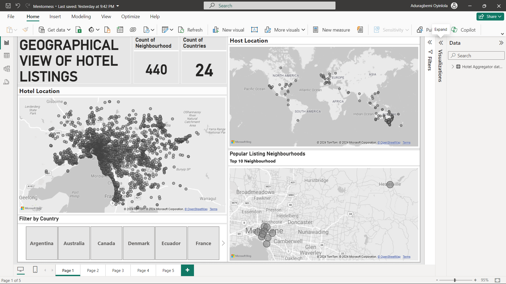
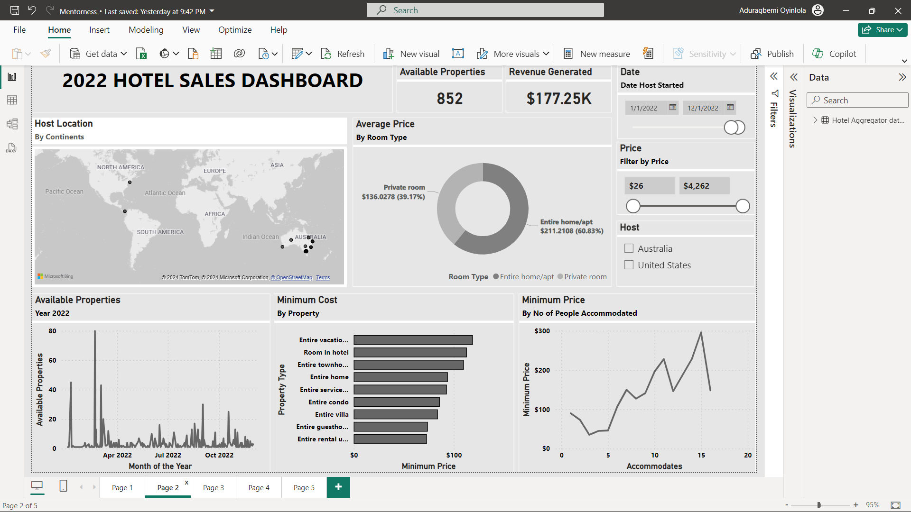
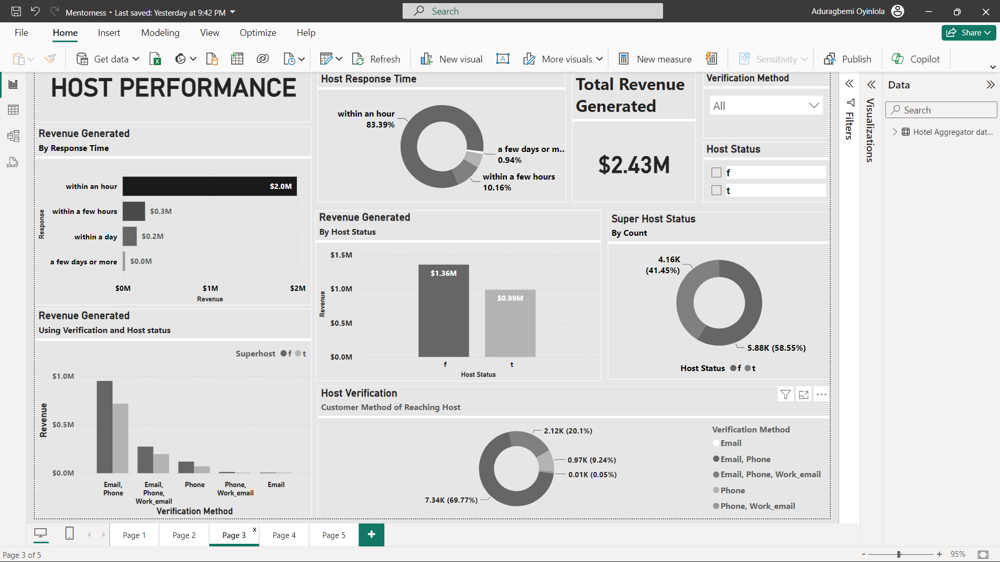
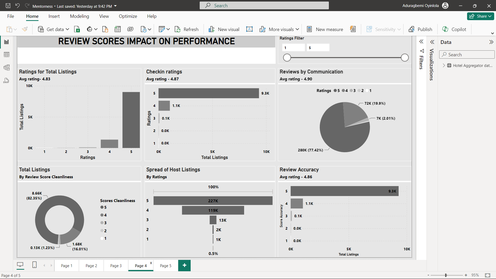
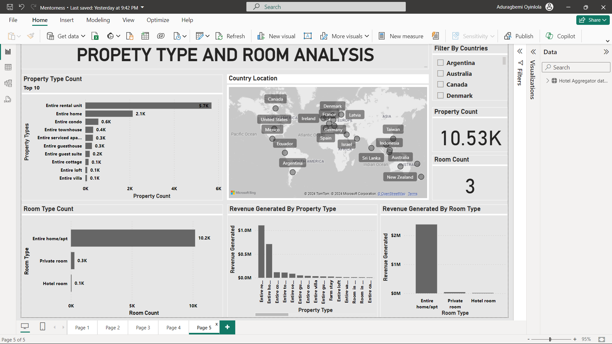

<!-- _class: invert -->

### **HOTEL AGGREGATOR   ANALYSIS IN  POWER BI**
 
 
 
 
 

#### BY ADURAGBEMI OYINLOLA

---
<!-- _class: invert -->
### Problem Statement:

This internship project aims to analyse a dataset of hotel aggregator listings using Power BI. The dataset comprises various attributes related to listings, hosts, reviews, and availability. The objective is to create comprehensive visualizations and insights that shed light on trends, patterns, and factors influencing the performance of listings. Through Power BI, interns will explore key metrics such as pricing, availability, host characteristics, and review scores to derive actionable insights for improving the overall quality and competitiveness of the listings.

---
<!-- _class: invert -->
### Project Objectives:
1. **Geographical Insights:**
    - Visualize the distribution of listings on a map to identify popular neighborhoods.
    - Explore the geographical concentration of listings and host locations.
2. **Pricing and Availability Analysis:**
    - Analyze pricing trends based on property types, room types, and accommodation capacity.
    - Investigate the availability of listings over time and identify peak periods.

---
<!-- _class: invert -->
3. **Host Performance:**
    - Evaluate host characteristics, including superhost status, response times, and verification methods.
    - Explore correlations between host attributes and listing performance.
4. **Review Scores and Guest Satisfaction:**
    - Examine review scores and their impact on overall listing performance.
    - Identify areas for improvement based on specific review categories.

---
<!-- _class: invert -->
5. **Property Type and Room Analysis:**
    - Analyse the distribution of property types and room types.
    - Explore trends in the popularity of specific accommodation setups.

---

---

---

---

---

